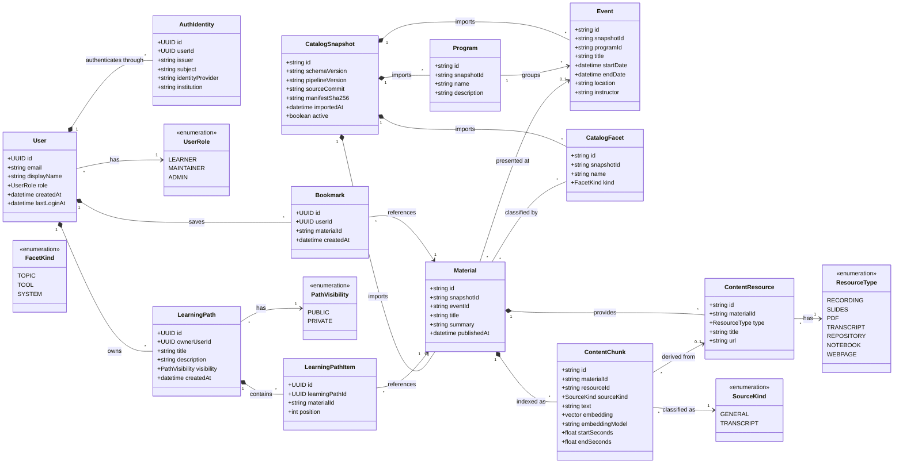

```mermaid
classDiagram
direction LR

class User {
  +UUID id
  +string email
  +string displayName
  +UserRole role
  +datetime createdAt
  +datetime lastLoginAt
}

class AuthIdentity {
  +UUID id
  +UUID userId
  +string issuer
  +string subject
  +string identityProvider
  +string institution
}

class UserRole {
  <<enumeration>>
  LEARNER
  MAINTAINER
  ADMIN
}

class Bookmark {
  +UUID id
  +UUID userId
  +string materialId
  +datetime createdAt
}

class LearningPath {
  +UUID id
  +UUID ownerUserId
  +string title
  +string description
  +PathVisibility visibility
  +datetime createdAt
}

class LearningPathItem {
  +UUID id
  +UUID learningPathId
  +string materialId
  +int position
}

class PathVisibility {
  <<enumeration>>
  PUBLIC
  PRIVATE
}

class CatalogSnapshot {
  +string id
  +string schemaVersion
  +string pipelineVersion
  +string sourceCommit
  +string manifestSha256
  +datetime importedAt
  +boolean active
}

class Program {
  +string id
  +string snapshotId
  +string name
  +string description
}

class Event {
  +string id
  +string snapshotId
  +string programId
  +string title
  +datetime startDate
  +datetime endDate
  +string location
  +string instructor
}

class Material {
  +string id
  +string snapshotId
  +string eventId
  +string title
  +string summary
  +datetime publishedAt
}

class ContentResource {
  +string id
  +string materialId
  +ResourceType type
  +string title
  +string url
}

class ResourceType {
  <<enumeration>>
  RECORDING
  SLIDES
  PDF
  TRANSCRIPT
  REPOSITORY
  NOTEBOOK
  WEBPAGE
}

class CatalogFacet {
  +string id
  +string snapshotId
  +string name
  +FacetKind kind
}

class FacetKind {
  <<enumeration>>
  TOPIC
  TOOL
  SYSTEM
}

class ContentChunk {
  +string id
  +string materialId
  +string resourceId
  +SourceKind sourceKind
  +string text
  +vector embedding
  +string embeddingModel
  +float startSeconds
  +float endSeconds
}

class SourceKind {
  <<enumeration>>
  GENERAL
  TRANSCRIPT
}

User "*" --> "1" UserRole : has
User "1" *-- "*" AuthIdentity : authenticates through
User "1" *-- "*" Bookmark : saves
Bookmark "*" --> "1" Material : references

User "1" *-- "*" LearningPath : owns
LearningPath "*" --> "1" PathVisibility : has
LearningPath "1" *-- "*" LearningPathItem : contains
LearningPathItem "*" --> "1" Material : references

CatalogSnapshot "1" *-- "*" Program : imports
CatalogSnapshot "1" *-- "*" Event : imports
CatalogSnapshot "1" *-- "*" Material : imports
CatalogSnapshot "1" *-- "*" CatalogFacet : imports

Program "1" --> "*" Event : groups
Material "*" --> "0..1" Event : presented at
Material "1" *-- "*" ContentResource : provides
Material "*" -- "*" CatalogFacet : classified by

ContentResource "*" --> "1" ResourceType : has
Material "1" *-- "*" ContentChunk : indexed as
ContentChunk "*" --> "0..1" ContentResource : derived from
ContentChunk "*" --> "1" SourceKind : classified as
```
